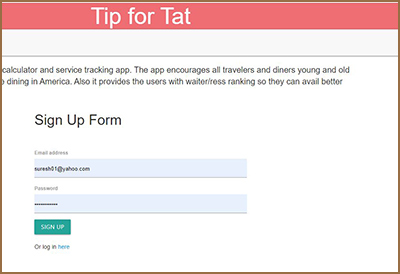

# Tip for Tat

## Deploy Link & Code Repository

    - Heroku 

    - GitHub
      [repository](https://github.com/s-suresh-kumar/Eat-Da-Burger)

## Introduction

This app is designed with the intention to encourage diners to tip when at restaurant. The ultimate concept of this application is to incentivize diners by rewarding them for tips.

## Technologies Used

HTML, CSS, JavaScript, Materialize, Express, Node, MySQL, Sequelize, Passport.

## Featured Files

     # Front End
        # js
        currentTip.js, members.js, previoustips.js, signup.js
        # stylesheets
        calculator.css, style.css
        # HTML
        currentTip.html, login.html, members.html, previoiustip.html, signup.html

    # Back End
        server.js,
        # routes
        api-routes.js, html-routes.js
        # models
        index.js, resturaunt.js, user.js, waiter.js
        #db
        schema.sql, seeds.sql
        #config
        config.js, config.json, passport.js
            # middleware
            isAuthenticated.js
